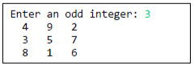
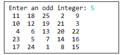

# Programming 2 - Lab 5

This template repository is the starter project for Programming 2 Lab 5. Written in Java, and tested with Gradle/JUnit.

### Questions

1. A magic square is an N-by-N matrix of the integers, such that all row, column, and diagonal sums are equal. For example,

   4 9 2  
   3 5 7  
   8 1 6

is a magic square, because the sum of row is 15 (4+9+2 = 15) and, 3+5+7 = 15, 8+1+6 = 15), and the sum of each column is 15 (4+3+8=5, 9+5+1=15, 2+7+6 = 15) and the sum of the 2 diagonals is 15 (4+5+6 = 15, 2+5+8 = 15).

Write a Java method to test if a matrix represents a magic square.

2. One way to generate a magic square of size n, when n is odd is to assign the integers 1 to n^2 in ascending order, starting at the bottom, middle cell. Repeatedly assign the next integer to the cell adjacent diagonally to the right and down. If this cell has already been assigned another integer, instead use the cell adjacently above. If the new column is outside the square start back at the first column. If the new row is outside the square, start back at the beginning of the row.

Write a Java method to generate a magic square of a given odd size. For example, if the user enters 3, you should generate:

if the user enters 5, you should generate:

### Setup Command

`gradle clean`

### Run Command

`gradle test`
"# programming-2-lab-5-dawodahmadi" 
